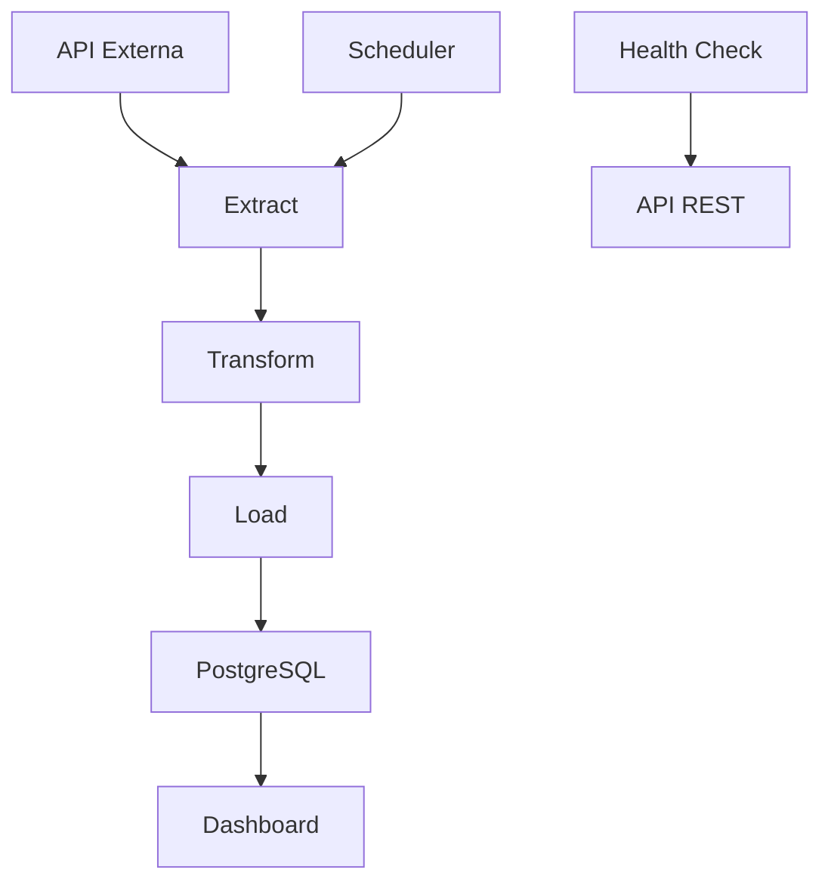

# ETL Extract API

Bem-vindo à documentação oficial do **ETL Extract API**!

## 🚀 Visão Geral

O ETL Extract API é um sistema completo para extração, transformação, carga e visualização de dados de cotação do dólar (USD-BRL). Ele automatiza a coleta de dados de APIs externas, processa e armazena em banco de dados, e oferece um dashboard interativo para análise.

## 🎯 Objetivos
- Automatizar o monitoramento da cotação do dólar
- Disponibilizar dados históricos e em tempo real
- Facilitar a análise e visualização dos dados
- Servir como base para estudos, integrações e aplicações financeiras

## 🔑 Principais Funcionalidades
- Pipeline ETL agendado (dias úteis, 08:00-19:00)
- Health checks para monitoramento dos serviços
- Dashboard interativo com filtros de período
- Armazenamento seguro em PostgreSQL
- Deploy fácil na nuvem (Render, Streamlit Cloud)

## 🏗️ Arquitetura do Projeto



## 📁 Estrutura do Projeto

```
ETL_Extract_API/
├── src/
│   ├── api/                 # Endpoints da API REST
│   │   ├── health_api.py    # Health check
│   │   └── pipeline_web.py  # Pipeline como web service
│   ├── dashboard/           # Interface de visualização
│   │   └── dashboard.py     # Dashboard Streamlit
│   ├── pipeline/            # Pipeline ETL
│   │   ├── extract.py       # Extração de dados
│   │   ├── transform.py     # Transformação
│   │   └── load.py          # Carga no banco
│   ├── database/            # Camada de dados
│   │   └── database.py      # Modelos ORM
│   ├── config/              # Configurações
│   │   └── config.py        # Variáveis de ambiente
│   └── main.py              # Execução local do pipeline
├── docs/                    # Documentação
├── requirements.txt         # Dependências Python
└── README.md               # Documentação Principal
```

## 🚀 Começando

1. [Configuração](config.md) - Configure variáveis de ambiente
2. [API](api.md) - Explore os endpoints de health check
3. [Dashboard](dashboard.md) - Use a interface visual
4. [Pipeline ETL](pipeline.md) - Entenda o fluxo de dados

## 📈 Status do Projeto

- ✅ Pipeline ETL funcionando
- ✅ Health checks implementados
- ✅ Dashboard interativo
- ✅ Deploy na nuvem
- ✅ Documentação completa

---

Acesse as seções ao lado para detalhes sobre cada parte do sistema! 