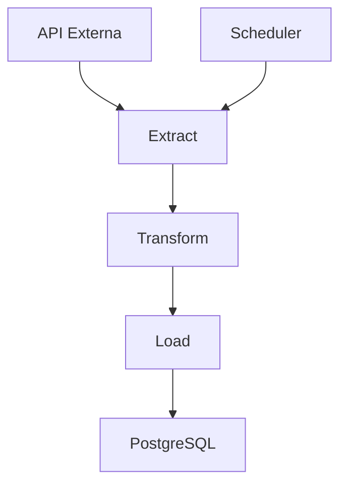

# Pipeline ETL

O pipeline ETL (Extract, Transform, Load) é o núcleo do sistema, responsável por coletar, processar e armazenar os dados de cotação do dólar.

## Fluxo do Pipeline

1. **Extração**
   - Coleta dados de APIs externas de cotação do dólar
   - Executa apenas em dias úteis, das 08:00 às 19:00 (horário de Brasília)
2. **Transformação**
   - Valida e padroniza os dados recebidos
   - Converte formatos de data/hora e valores
3. **Carga**
   - Insere os dados processados no banco PostgreSQL
   - Garante integridade e evita duplicidades

## Agendamento e Controle de Horário
- O pipeline roda automaticamente em loop, respeitando a janela de horário configurada
- **Horário permitido:** Segunda a sexta-feira, das 08:00 às 19:00 (horário de Brasília)
- **Fora do horário:** Apenas logs informativos são gerados a cada 10 minutos
- **Fins de semana:** Não executa (sábados e domingos)

## Execução em Background
- O pipeline pode ser executado como serviço web no Render
- Roda em thread separada para não bloquear o serviço
- Health check disponível para monitoramento

## Logs e Monitoramento
- Todos os passos do pipeline são registrados em logs estruturados
- Erros e exceções são tratados e logados
- Logs podem ser visualizados no console ou em sistemas externos

## Exemplo de Fluxo

## Observações
- O pipeline é modular e pode ser adaptado para outras moedas ou fontes de dados
- O código está em `src/pipeline/`
- Execução local via `python src/main.py`
- Execução como serviço via `src/api/pipeline_web.py` 